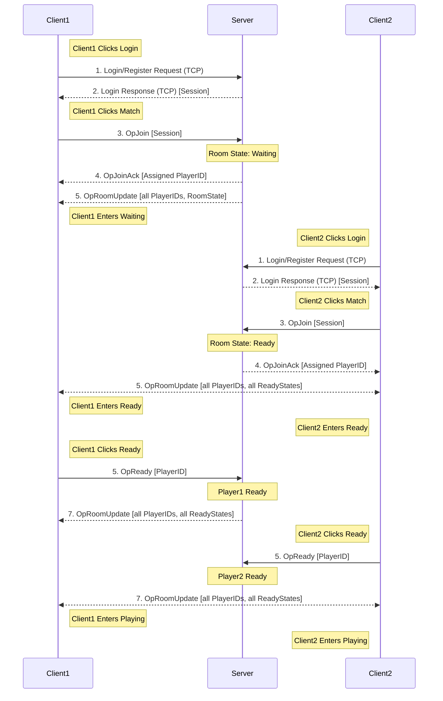

# Network flow

### Join Game


### LeaveGame
```mermaid
sequenceDiagram

    participant C1 as Client1
    participant S as Server
    participant C2 as Client2
    note right of C1: Client1 Clicks Leave
    C1->>S: 1. OpLeave [PlayerID]
    note over S: RoomState: Waiting
    S-->>C1: 3. OpRoomUpdate [all PlayerIDs, RoomState]
    note left of C2: Client2 Enters Waiting
    note right of C1: Client1 in MatchPanel
    note right of C2: Loop until Client2 Clicks Leave
    note left of C2: Client2 Clicks Leave
    C2->>S: 1. OpLeave [PlayerID]
    note over S: RoomState: Empty
    S-->>C2: 3. OpRoomUpdate [all PlayerIDs, RoomState]
    note over S: Room Deleted